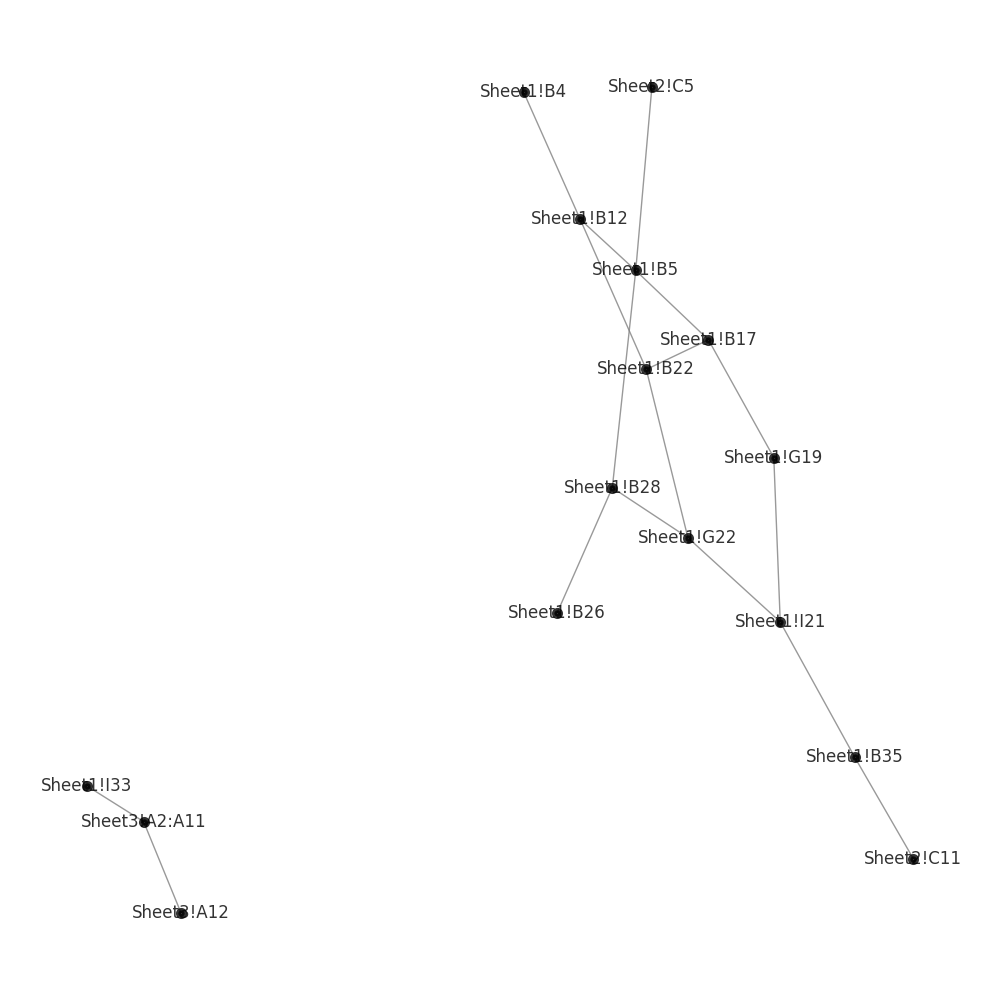

# Graphed Excel




Python script to visualize dependencies between cells in Excel spreadsheets.

Meant as a tool to visualize and understand the complexity of Excel spreadsheets.

Will generate a graph of the dependencies between cells in an Excel spreadsheet. Data extracted with `openpyxl` (<https://foss.heptapod.net/openpyxl/openpyxl>), the graph is generated with the `networkx` library (<https://networkx.org/>) and is visualized using `matplotlib`.

This is a simple tool and maybe even naïve in its approach - it was hacked together in two evenings and would benefit from some refactoring and more features. It is meant as a starting point for further development.
<br clear="right"/>

## Definitions

Single-cell references in a formula sitting in cell `A3` like `=A1+A2` is considered a dependency between the node `A3` and the nodes `A2` and `A1`.

A range defined in a formula like `=SUM(B1:B200)` is semantically handled like a single reference or node in the tree and not 200 individual nodes in the graph.

The way the graph is built is by iterating over all cells in the spreadsheet and extracting the references in the formula of each cell. The references are then added as edges in the graph.

A cell within a range is considered a dependency of the range itself, but not of the other cells in the range.

## Installation

```bash

python -m venv venv
source venv/bin/activate
pip install -r requirements.txt
```

## Usage

```bash
python graphbuilder.py <path_to_excel_file> [--verbose] [--no-visualize] [--keep-direction] [--open-image]
```

Depending on the size of the spreadsheet you might want to adjust the plot configuration in the code to to make the graph more readable (remove labels, decrease widths and sizes etc)

### Arguments

`--verbose` will dump formula cell contents during (more quiet)

`--no-visualize` will skip the visualization step and only print the summary (faster)

`--keep-direction` will keep the direction of the graph as it is in the excel file, otherwise it will be simplified to an undirected graph (slower)

`--open-image` will open the generated image in the default image viewer (only on Windows)

## Sample output

The following is the output of running the script on the provided `Book1.xlsx` file.

```bash
=== Dependency Graph Summary ===
Cell/Node count                50
Dependency count               60

=== Nodes with the highest degree ===
Range!F1                       10
Base!B5                         4
Base!B12                        3
Base!B17                        3
Base!I21                        3
Base!G22                        3
Base!B22                        3
Base!B28                        3
Range!B2                        3
Range!B3                        3

=== Formula functions by count ===
SUM                             3
POWER                           1

Visualizing the graph of dependencies.
This might take a while...

Graph visualization saved to images/.\Book1.xlsx.png
```

## Sample plot

More in `/images` folder.


## Tests

```bash
pytest test_cell_reference_extraction.py
```

## Contribute

Feel free to contribute by opening an issue or a pull request.

You can help with the following, that I have thought of so far:

- Add more tests
- Improve the code
- Add more features
- Improve the visualization and the ease of configuration
- Add more examples
- Add more documentation
- Package the script for easier installation and use with PyPi
